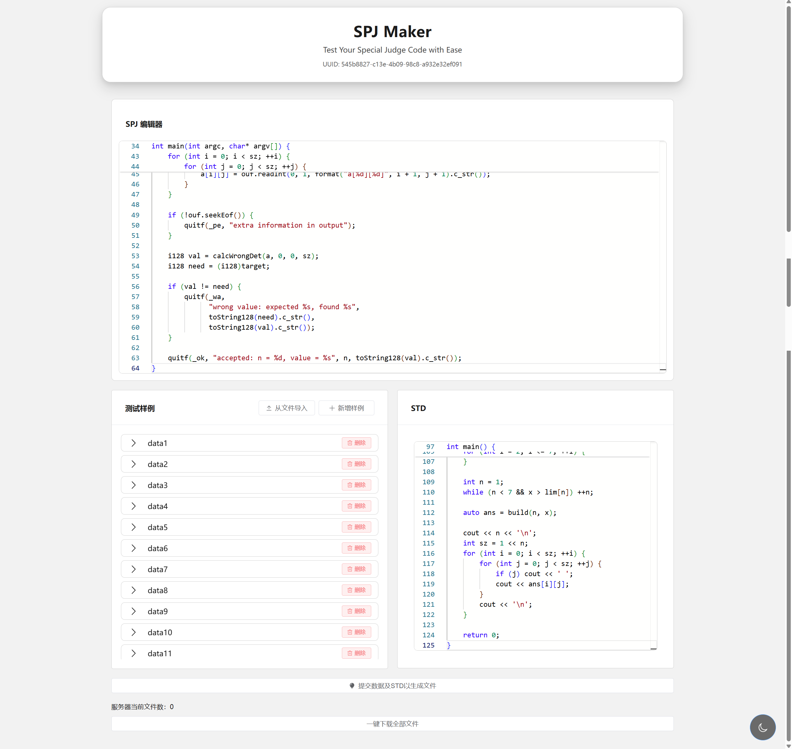
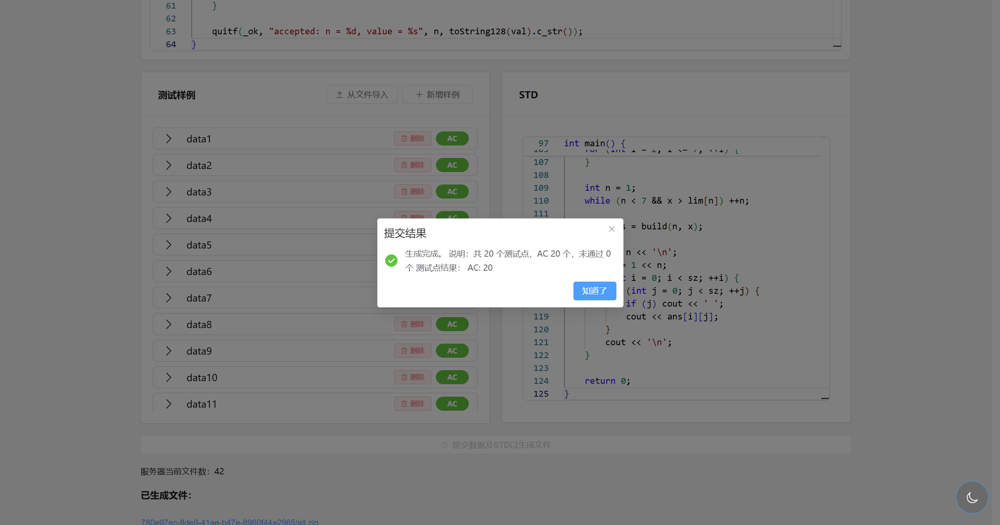

# SPJ Maker

`SPJ Maker` 是一个用于生成、调试和打包特殊评测（Special Judge, SPJ）题目的工具项目，包含：

- 一个基于 `Flask` 的后端服务
- 一个基于 `Vue 3 + Vite + TypeScript` 的前端界面
- 一套用于保存测试数据、标准程序和 SPJ 源码的题目目录结构

## 项目特点

- 使用 `uv` 管理 Python 依赖和运行环境
- 支持生成测试点、保存 `spj.cpp` / `std.cpp`
- 支持题目数据打包下载
- 前后端分离，便于本地开发和后续部署

## 界面预览

### 总览界面



### 提交与配置界面



## 项目结构

```text
SPJ_Maker/
├── main.py                  # Flask 后端入口
├── pyproject.toml           # Python 项目配置（由 uv 管理）
├── uv.lock                  # uv 生成的锁文件
├── code/
│   ├── testlib.h            # 公共 testlib 头文件
│   └── <uuid>/              # 每个题目的临时/导出目录
│       ├── data*.in         # 输入数据
│       ├── judge.yaml       # 题目打包信息
│       ├── judge_results.json
│       ├── spj.cpp          # 特殊评测程序
│       ├── std.cpp          # 标准程序
│       └── testlib.h
├── frontend/                # 前端源码项目（在这里执行 pnpm 构建）
└── static/                  # 前端构建输出目录与图片资源目录
```

## 环境要求

- Python 3.11+
- `uv`
- Node.js 20+
- `pnpm`（前端构建需要）

## 使用 `uv` 管理后端

本项目的 Python 部分**使用 `uv` 管理**，不是通过 `requirements.txt` 或手动 `pip install` 维护依赖。

首次使用时，先安装 `uv`，然后在项目根目录执行依赖同步：

```bash
uv sync
```

这条命令会根据 `pyproject.toml` 和 `uv.lock` 创建/更新虚拟环境并安装依赖。

### 常用命令

```bash
uv sync
uv run main.py
uv add <package-name>
uv remove <package-name>
```

说明：

- `uv sync`：同步依赖到本地虚拟环境
- `uv run python main.py`：在 `uv` 管理的环境中启动后端
- `uv add`：添加 Python 依赖并更新锁文件
- `uv remove`：删除 Python 依赖并更新锁文件

## 快速开始

### 1. 克隆项目

```bash
git clone https://github.com/coolarec/SPJ_Maker.git
cd SPJ_Maker
```

### 2. 安装后端依赖

```bash
uv sync
```

### 3. 启动后端

```bash
uv run main.py
```

默认监听地址：`http://127.0.0.1:5000/spjmaker`

各 API 路由分别位于 `http://127.0.0.1:5000/spjmaker/api`中

### 4. 启动前端开发环境

```bash
cd frontend
pnpm install
pnpm dev
```

前端默认开发地址为：`http://localhost:5173`

### 5. 构建前端到 `static/`

前端构建不是输出到 `frontend/dist/`，而是**直接输出到项目根目录的 `static/`**，便于后端直接托管静态文件。

```bash
cd frontend
pnpm build
```

构建完成后，生成结果会写入：`SPJ_Maker/static/`

## 使用说明

后端入口位于 `main.py`，主要负责：

- 接收前端提交的题目配置
- 创建对应的 `code/<uuid>/` 工作目录
- 写入测试数据、`spj.cpp`、`std.cpp`
- 编译并运行标准程序 / SPJ
- 返回评测结果或打包文件

前端代码位于 `frontend/src/`，用于：

- 编辑题面相关内容
- 录入测试点
- 编辑 SPJ / 标程代码
- 查看评测结果并下载题目数据

## 开发说明

### Python 依赖管理

如果需要新增后端依赖，使用：

```bash
uv add xxx
```

如果只是运行某个脚本，也建议统一使用：

```bash
uv run <script>.py
```

这样可以确保命令始终运行在项目自己的虚拟环境里，避免“本机环境能跑，别人环境炸了”的经典节目。

### 前端依赖管理

前端使用 `pnpm` 管理依赖。

常用命令：

```bash
cd frontend
pnpm install
pnpm dev
pnpm build
```

其中：

- `pnpm dev`：启动前端开发服务器
- `pnpm build`：将前端打包到根目录下的 `static/`


## 备注

- `code/` 目录下默认只保留需要纳入版本控制的 `testlib.h`
- `static/` 目录既承担图片资源目录，也承担前端构建输出目录
